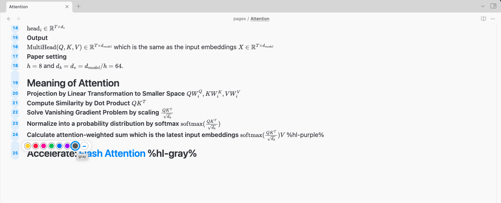
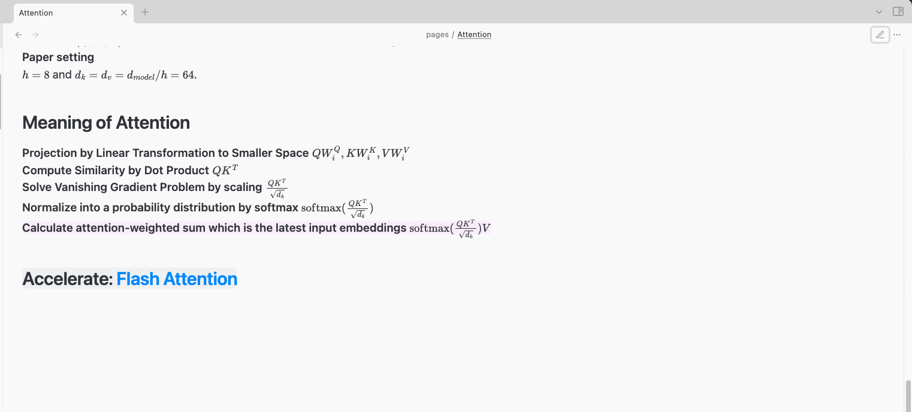

# Highlight By Line Number

**Highlight By Line Number** is an Obsidian plugin that lets you easily highlight individual lines in your notes using a simple `%hl-color%` marker syntax.  
It brings intuitive, colorful highlighting to both Reading and Live Preview modes—with a beautiful palette and instant visual feedback.

## ✨ Features

- **Highlight any line** with a color using `%hl-yellow%`, `%hl-blue%`, etc.
- **Works in both Reading & Live Preview:**  
  - In Reading mode, the **entire line** is softly highlighted (pastel color).
  - In Live Preview, the marker turns into a **vivid colored pill** at the end of the line.
- **Quick color picker:**  
  Click a line number to instantly pick a highlight color from the palette.
- **Supports all basic Obsidian blocks** (paragraphs, headings, blockquotes, etc).
- **Easy to use, readable in plain Markdown**.


## 🌈 Screenshots

### Color Palette in Live Preview



### Highlighted Lines in Reading Mode



## 📝 Usage

1. **Highlight a line manually:**  
   Add `%hl-yellow%`, `%hl-blue%`, `%hl-red%`, etc. at the end of any line.

   ```markdown
   This is a normal line.
   This is important! %hl-yellow%
   ```

2. **Highlight with the palette:**  
   - In Live Preview, click any **line number** on the left.
   - Choose a color from the palette to highlight that line, or click the minus (–) to clear the highlight.

3. **See it in action:**  
   - **Reading mode:** The entire line is softly highlighted.


## 🚦 Supported Colors

- Yellow
- Red
- Pink
- Green
- Blue
- Purple
- Gray


## 🗒 TODO

- [ ] **Highlight in Lists:**  
      Highlight sometimes does **not** apply to lines inside certain Markdown lists.  
      _(Planned to be fixed in a future update!)_
- [ ] **Customization:**  
      Custom highlight colors and palette are planned.
- [ ] **Better rendering of `%hl-color%` as color pill in Live Preview:**  
      (Improved support coming soon)
  
## 🛠️ Contributing

Pull requests and suggestions are welcome!  

## 📜 License

[0BSD license](./LICENSE)

## 🙏 Credits

Inspired by the Obsidian community and built with the official plugin template.
